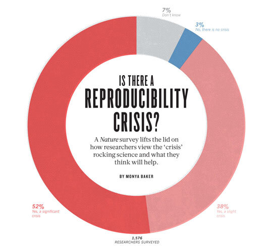

\

## Survey sheds light on the 'crisis' rocking research. {#markdown-header}
**More than 70% of researchers have tried and failed to reproduce another scientist's experiments,** and more than half have failed to reproduce their own experiments. Those are some of the telling figures that emerged from *Nature's* survey of 1,576 researchers who took a brief online questionnaire on reproducibility in research. 
\

The data reveal sometimes-contradictory attitudes towards reproducibility. Although 52% of those surveyed agree that there is a significant 'crisis' of reproducibility, less than 31% think that failure to reproduce published results means that the result is probably wrong, and most say that they still trust the published literature. 


\  


## The Survey
In the survey [^1] respondents were asked to rate 11 different approaches to improving reproducibility in science. Below is the list order by the most highly rated: 

* Better understanding of statistics
* Better mentoring/supervision 
* More robust design 
* Better teaching 
* More within-lab validation 
* Incentives for better practice 
* Incentives for formal reproduction 
* More external-lab validation 
* More time for mentoring 
* Journals enforcing standards 
* More time checking notebooks

### Tables 

| Column 1    | Column 2    |
| ----------- | ----------- |
| Item 1,1    | Item 1,2    |
| Item 2,1    | Item 2,2    |

### Blocks 

```
print("Hello world")
x <- 1+2
print(x)
```


<!--## Heading 3 
More text here and [this is the link](#markdown-header)

This is a link to an [external website](https://github.com/)
This text has a footnote [^1] and another one [^2]

#### Numbered lists 
1. Item 1 
2. Item 2 
    a. item 2a
        i. item 2ai 
3. Item 3

#### Bulleted lists 
* Item 1 
* Item 2
* Item 3

#### Task lists 
- [ ] Task 1 
- [x] Task 2 is complete 
\
-->


[^1]: The survey can be downloaded [here](https://www.google.com/)